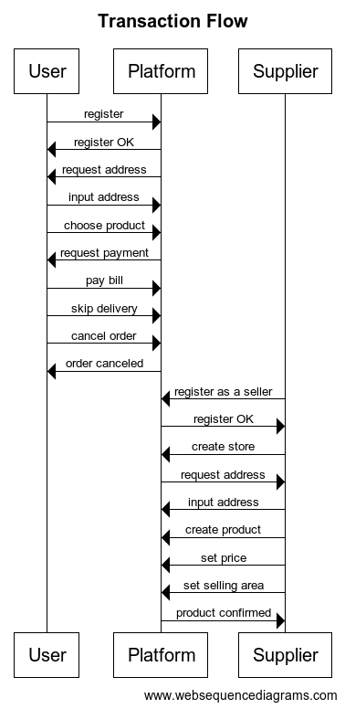

# Basic concepts

## 1. Coding
   **A. Code smell** is a piece of code that made the whole code didn't well performed such as dead code, identical code. One of the smell code is duplicate code which between the code function look almost identical, so it needs to be eliminate one of them or combine the code function.
   For example:
   There were two functions of code
   ```python
   def sum(a, b):
      return a+b
   ```

   ```python
   def add(a, b):
      c = a+b
      return c
   ```

   The functions of code has the same return, so it will be better to refactor it with combine or eliminate one of them.

   **B. Dependency Injection (DI)** used to manage how class function depend on another class to be able to use. So it needs some kind of middleman to access that class. It is important when some classes may depend on another class, so instead of accessing that class directly, it will be better to create a constructor for that class.
   Without DI, the code may difficult for both maintain and scalable purpose due to more complex code if the classes may depend one to another and possible to cause slowing down performance.

## 2. Rest API

   **A. POST** -> do it for submit new data

   ```
   POST /test/kulina_form.php HTTP/1.1
   host: kulina.id
   name1=value1&name2=value2
   ```

   don't use POST to create a command, for example:

   ```
   POST /api/v2/CreateOrder
   POST /api/v2/GetOrder?id=12345
   ```

   but, use POST and GET instead:

   ```
   POST /api/v2/orders
   GET /api/v2/orders
   ```


   **B. GET** -> do it for requesting data

   ```
   GET /test/kulina_form.php?name1=value1&name2=value2
   ```

   don't ever put sensitive information on GET such as password, because it will store the data into both browser history and cached.


<div style="page-break-after: always;"></div>


# Basic coding

## Design System
1. User Friendly
Make it easier, guide step-by-step for both user and supplier
2. Efficient
Not giving extra effort to order up products, such as twice input.
3. Fast
Seamless process even with poor connection
4. Helpful
Help supplier make better decision by let them know their product decision supply such as selling area.
5. Avoid Errors
For users give it a clear instruction that the order is cancelable. For suppliers show the contextual action bar when changes are made for their products input.
6. Immidiate UI Feedback
Confirm succesful message with toast component, for easy, fast and eye-catchy experience

## Transaction flow
<p align="center">
    
</p>

<div style="page-break-after: always;"></div>

# Algorithm

## 1. Nick's clothing store.
   1. input number of socks (n)
   2. `if n >= 1 and n <= 100`: goto 3, `else` back to 1
   3. input sock's color available (ar)
   4. `if len(ar) >= 0 and len(ar) <= n`: goto 5, `else` back to 3
   5. sellablePairs(ar)
      1. get a color
      2. pop color from ar
      3. compare to another
      4. if same color: pairs++, pop
      5. back to iii, til the end of color
      6. back to i, else return pairs

## 2. Bill the avid hiker.
   1. input n
   2. `if n >= 2`: goto 3, `else`: error
   3. input s
   4. `if len(s) == n`: goto 5, `else`: error
   5. countingValleys()
      1. for step in s:
         1. temp = sea_level
         2. `if step = U`: sea_level++, `if step = D`: sea_level--
         3. `if temp = 0 and sea_level = -1`: temp_valley += 0.5
         4. `if temp = -1 and sea_level = 0`: temp_valley += 0.5
         5. repeat
      2. valley = floor(temp_valley)
      3. return valley

## 3. pseudo GoLang 1.345.679
   1. input number
   2. while number !=0 :
      1. num = number % 10
      2. outputs.append(num*zeros)
      3. number = number // 10
      4. zeros = zeros*10
   3. for output in reversed(output):
      1. print(output)

## 4. Andrew's lamp trip
   1. declare int lamp[100] = 0
   2. switch(lamp)
      1. if lamp == 0: return 1
      2. else return 0
   3. first trip: for i in range(0,100): lamp[i] = switch(lamp[i]) 
   4. for trip in range (2, switches):
      1. while trip**n < 100:
         1. switches = trip**n
         2. `lamp[switches]` = switch(`lamp[switches`)
         3. n += 1
   5. print sum(lamp)