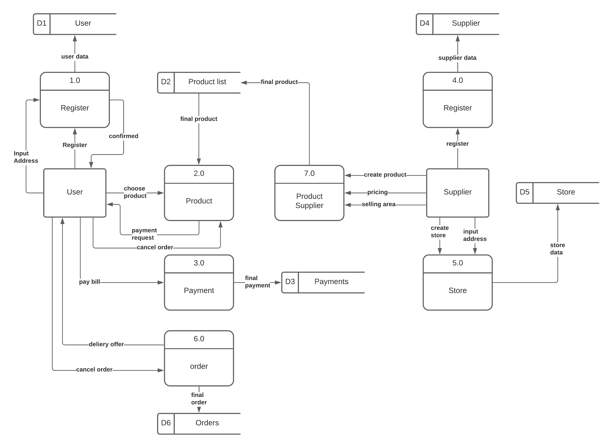

# Basic coding

## Design System
1. User Friendly
Make it easier, guide step-by-step for both user and supplier
2. Efficient
Not giving extra effort to order up products, such as twice input.
3. Fast
Seamless process even with poor connection
4. Helpful
Help supplier make better decision by let them know their product decision supply such as selling area.
5. Avoid Errors
For users give it a clear instruction that the order is cancelable. For suppliers show the contextual action bar when changes are made for their products input.
6. Immidiate UI Feedback
Confirm succesful message with toast component, for easy, fast and eye-catchy experience

## Transaction flow

